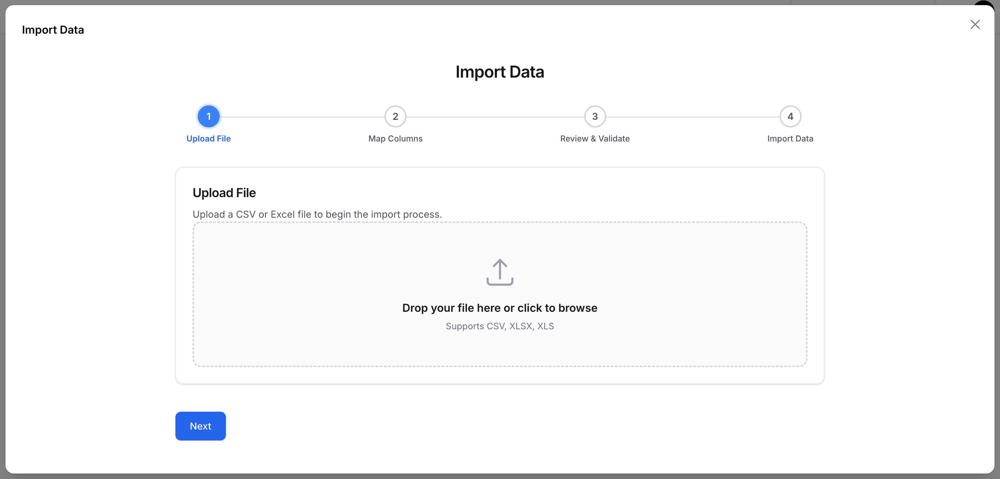
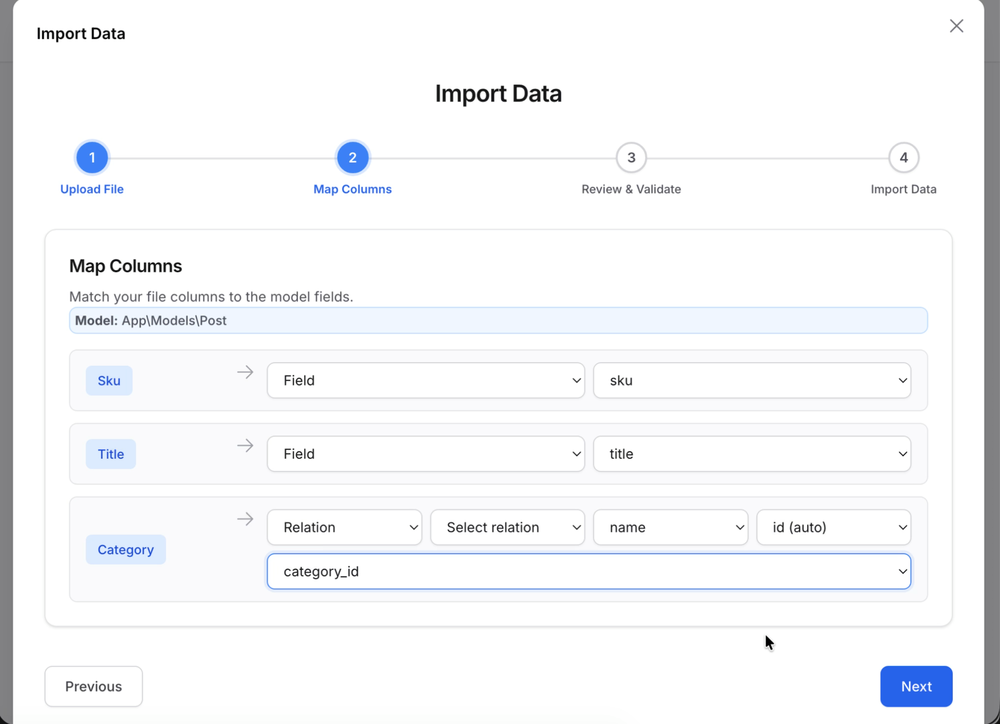
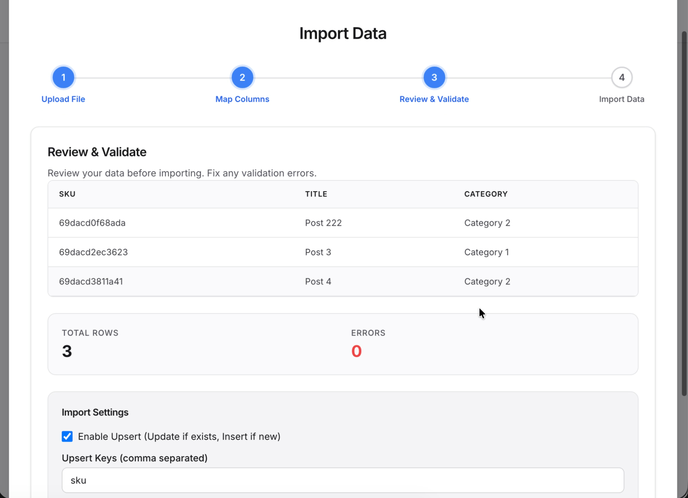
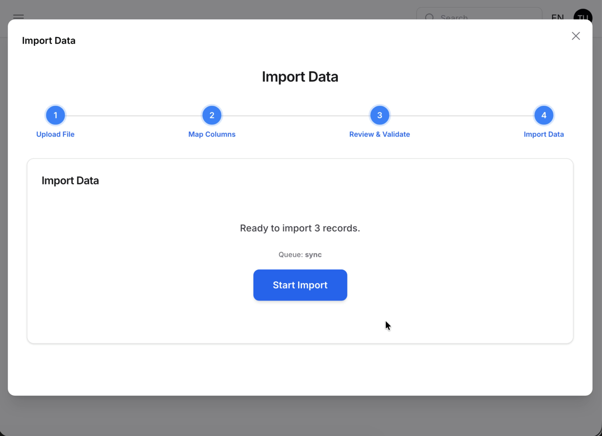

# Filament Import Wizard

A powerful, queue-powered CSV and Excel import wizard for Filament with smart column mapping, relationship linking, and background processing for 100K+ rows.


https://github.com/user-attachments/assets/1a5d1015-0d0f-4c11-b8e7-7f58f8bc63fa

## ✨ Features

- **4-Step Import Wizard** — Upload, map columns, review data, and import inside a Filament modal
- **Smart Column Mapping** — Auto-detect CSV headers and map to model fields or relationships
- **Relationship Linking** — Link or create related records (`BelongsTo`)
- **Upsert Support** — Update existing records instead of creating duplicates via configurable keys
- **Queue-Powered Processing** — Chunked batch execution with live progress tracking for large datasets
- **Error Review** — Inline validation and error download before import
- **Multi-Tenancy Ready** — Built-in team and tenant scoping across queue boundaries
- **Standalone Mode** — Use as a Livewire component outside Filament panels
- **Dark Mode** — Full dark theme support out of the box

## 📦 Installation

```bash
composer require waad/filament-import-wizard
```

### Publish Configuration & Migrations

```bash
# Publish config file (optional)
php artisan vendor:publish --tag="filament-import-wizard-config"

# Publish and run migrations
php artisan vendor:publish --tag="filament-import-wizard-migrations"
php artisan migrate
```

> ⚠️ if there are errors for `css` try assets filament
> `php artisan filament:assets`

## 🚀 Usage

### Basic Usage in Filament Resource

Add the import action to your Filament resource's table
example (`app/Filament/Resources/Posts/Pages/ListPosts.php`):

```php
use Waad\FilamentImportWizard\Actions\ImportWizardAction;

protected function getHeaderActions(): array
{
    return [
        ImportWizardAction::make()
            ->forModel(\App\Models\Product::class), // optional
    ];
}
```

### Advanced Configuration

```php
ImportWizardAction::make()
    ->forModel(\App\Models\Product::class)  // optional
    ->chunkSize(500)           // Process 500 rows per job
    ->enableUpsert(true)       // Update existing records
    ->upsertKeys(['sku']);     // Match by SKU field
```

### Standalone Usage

Use the wizard outside of Filament panels via Livewire:

```blade
@livewire('filament-import-wizard', ['modelClass' => \App\Models\Product::class])
```

## ⚙️ Configuration

```php
// config/filament-import-wizard.php

return [
    'modal_width' => Width::Full,        // Modal width (Filament Width enum)
    'chunk_size' => 1000,                // Rows per queue job
    'default_csv_delimiter' => ',',      // CSV delimiter (comma, semicolon, tab)
    'queue_connection' => null,          // Queue connection (null = default)
    'queue_name' => null,                // Queue name (null = default)
];
```

### Configuration Explained

| Option | Default | Description |
|--------|---------|-------------|
| `modal_width` | `Width::Full` | Width of the import wizard modal |
| `chunk_size` | `1000` | Number of rows processed per queue job |
| `default_csv_delimiter` | `,` | Default CSV delimiter for parsing |
| `queue_connection` | `null` | Queue connection to use (`null` = Laravel default) |
| `queue_name` | `null` | Specific queue name (`null` = default queue) |

## 📋 Import Steps

### Step 1: Upload

Upload your CSV or Excel file. Supported formats:
- CSV (`.csv`)
- Excel (`.xlsx`, `.xls`)

### Step 2: Map Columns

Map CSV columns to model fields or relationships:
- **Field Mapping** — Map to direct model columns
- **Relation Mapping** — Link related records and configure foreign keys
- **Skip Columns** — Leave columns unmapped if not needed

### Step 3: Review

Preview your data before import:
- View first 20 rows with mapped columns
- See validation errors and row counts
- Configure upsert settings (optional)

### Step 4: Import

Start the import process:
- Background queue processing with live progress
- Error tracking and downloadable error logs
- Final summary with success/error counts

## 🔗 Relationship Linking

Link related records during import:

```php
// Example: Import products and link to categories
CSV Column: "Category Name" → Relation: category → Field: name
```

Supported relationship types:
- `BelongsTo`

## 🔃 Upsert (Match & Merge)

Update existing records instead of creating duplicates:

```php
ImportWizardAction::make()
    ->forModel(\App\Models\User::class)
    ->enableUpsert(true)
    ->upsertKeys(['email']);  // Match users by email
```

The wizard will:
1. Find existing records by the specified keys
2. Update matching records instead of creating new ones
3. Create new records only when no match is found

## 🛠️ Customization

### Custom Modal Width

```php
use Filament\Support\Enums\Width;

ImportWizardAction::make()
    ->forModel(\App\Models\Product::class)
    ->setModalWidth(Width::ExtraLarge);
```

### Queue Configuration

Set queue connection and name globally via config:

```php
// config/filament-import-wizard.php
return [
    'queue_connection' => 'redis',
    'queue_name' => 'imports',
];
```

## 📝 Requirements

- **PHP**: 8.2+
- **Laravel**: 10+
- **Filament**: 4.x or 5.x

## 📄 License

The MIT License (MIT). Please see [License File](LICENSE) for more information.

## 🤝 Contributing

Contributions are welcome! Please open an issue or submit a pull request.

## 📧 Support

If you discover any bugs or have feature requests, please open an issue on [GitHub](https://github.com/waad/filament-import-wizard/issues).

## Screenshot






